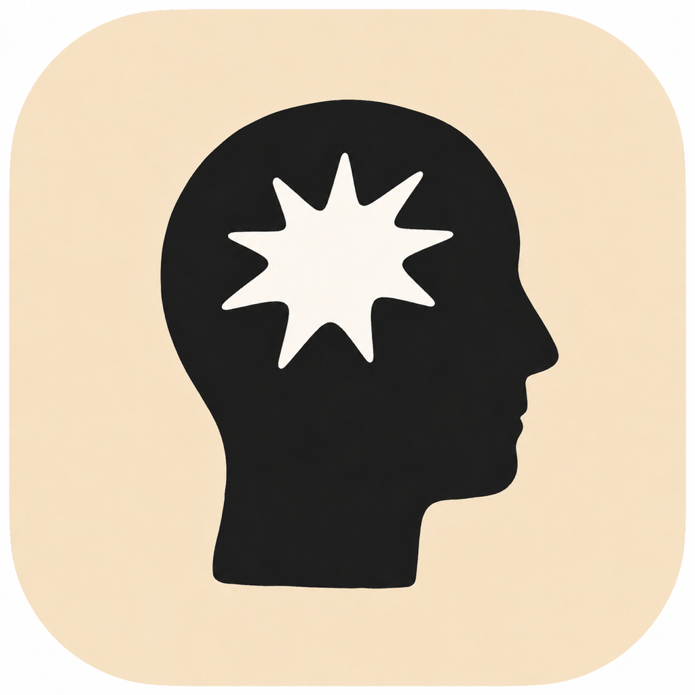

<p align="center">
  
</p>

<h1 align="center">Yobu</h1>

A macOS menu bar reminder app that makes easy-to-miss moments visible with short videos.

Yobu shows a video on top of your screen at a scheduled time or before a Google Calendar event. It is built for moments where a small text notification is too easy to ignore.

## What You Can Do

- Add `mp4`, `mov`, `m4v`, and `webm` files to a local video library.
- Show videos on specific dates, weekdays, times, or intervals.
- Show videos before Google Calendar events.
- Display videos in a frameless desktop Stage.
- Configure bubble text, loop playback, and audio per cue.
- Let AI tools call videos or create cues through the local MCP server.

## How It Works

1. Add a video.
2. Create a cue.
3. Choose when it should appear.
4. Yobu shows the video on your screen at the right moment.

## Core Concepts

- **Cue**: A saved rule for when a video should appear.
- **Library**: The local video collection used by Yobu.
- **Stage**: The overlay area where the video appears on screen.
- **MCP**: A local control interface that lets AI tools interact with Yobu.

## Requirements

- macOS Sonoma 14.6 or later
- Node.js
- pnpm

## Development

```bash
pnpm install
pnpm dev
pnpm test
pnpm build
pnpm package:mac
```

To generate the sample transparent-background video:

```bash
pnpm sample:transparent-video
```

## Google Calendar

Google Calendar integration uses Desktop OAuth with a local loopback redirect. Once connected, Yobu can show a cue before an event starts.

Enable the Google Calendar API in Google Cloud, create a Desktop OAuth Client, then add your credentials to a local `.env` file.

```env
YOBU_GOOGLE_CLIENT_ID=
YOBU_GOOGLE_CLIENT_SECRET=
```

`.env` is ignored by git.

## MCP

Yobu includes a local MCP server. When the app is running, AI tools can:

- list videos in the library
- add a local video file
- show a video immediately in the Stage
- create a cue
- list cues
- disable a cue

The MCP server is local-only.

## Build

The macOS DMG is generated at:

```text
dist/Yobu-0.1.0-arm64.dmg
```

Local development builds are unsigned and not notarized.

## Privacy

Yobu stores settings and imported videos in the macOS Application Support directory. It does not require a server account.

## License

MIT
